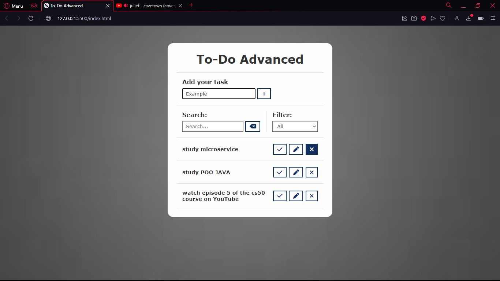

<h1>To-Do Advance</h1>
<h2>Example of Software</h2>

This application was developed using **HTML5, CSS** and JS** to create the To-Do.

<h2 id="pre-requisites"> Prerequisites</h2>

To run this project, you need to have Vs Code installed on your machine.

<h2 id="how-to-use"> Installing the Project</h2>

First, clone the repository,

<pre><code># Clone the repository
$ git clone https://github.com/jefersonprimer/to-do-list

# Navigate into it
$ cd to-do-list
</code></pre>

# Open Vs Code
$ code .
